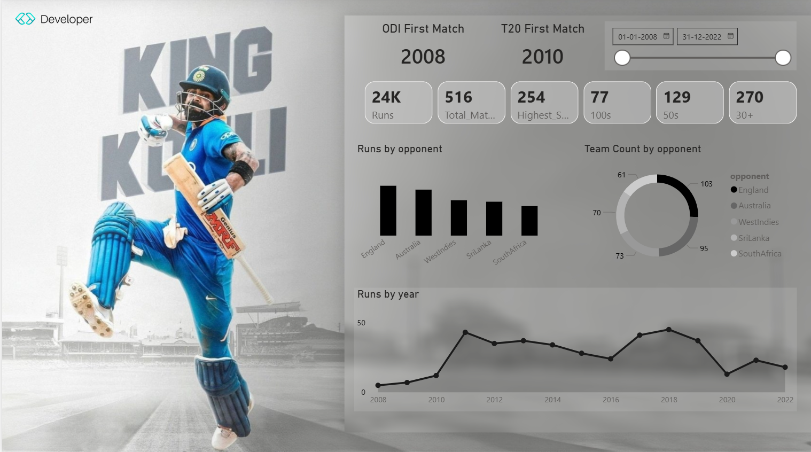

# 👑 King Kohli Career Analytics Dashboard | Power BI

An interactive **Power BI dashboard** analyzing Virat Kohli’s ODI & T20 international career performance (2008–2022).  
This project demonstrates data cleaning, modeling, DAX calculations, and business-focused storytelling using sports analytics.

---

## 📊 Dashboard Preview

<p align="center">
  
</p>

---

## 🚀 Project Highlights

- 📈 24K+ International Runs Analysis  
- 🏏 516 Total Matches Overview  
- 💯 77 Centuries & 129 Half-Centuries Tracking  
- 🎯 Highest Score: 254  
- 📅 Dynamic Date Range Slicer (2008–2022)  
- 🌍 Opponent-wise Performance Comparison  
- 📊 Year-wise Run Trend Analysis  

---

## 📌 Key KPIs Used

- Total Runs  
- Total Matches  
- Highest Score  
- 100s (Centuries)  
- 50s (Half-Centuries)  
- 30+ Scores  
- Runs by Opponent  
- Team Match Count by Opponent  
- Runs by Year  

---

## 🛠 Tech Stack

- **Power BI Desktop**
- DAX (Data Analysis Expressions)
- Data Modeling
- Data Cleaning & Transformation
- Interactive Data Visualization

---

## 📂 Repository Structure
```
king-kohli-career-analytics-dashboard/
│
├── data/
│ └── Source.csv
│
├── images/
│ └── dashboard.png
│
├── King_Kohli_Dashboard.pbix
├── README.md
└── LICENSE
```
---

## 📈 Analytical Insights

- England & Australia are among the highest run-scoring opponents.
- Peak career phase observed between 2016–2018.
- Strong consistency across formats with high 50+ conversion rate.
- Noticeable performance trends visible via year-based line chart.

---

## 🎯 What This Project Demonstrates

✔ Real-world KPI analysis  
✔ Data storytelling skills  
✔ Dashboard design principles  
✔ Interactive filtering & slicers  
✔ Business-style reporting approach  

This project is part of my **Data Analyst portfolio**, showcasing end-to-end dashboard development.

---

## 📥 How to Use

1. Clone the repository  
2. Download the `.pbix` file  
3. Open using **Power BI Desktop**  
4. Interact with filters & visuals  

---


## 📂 Repository Structure
